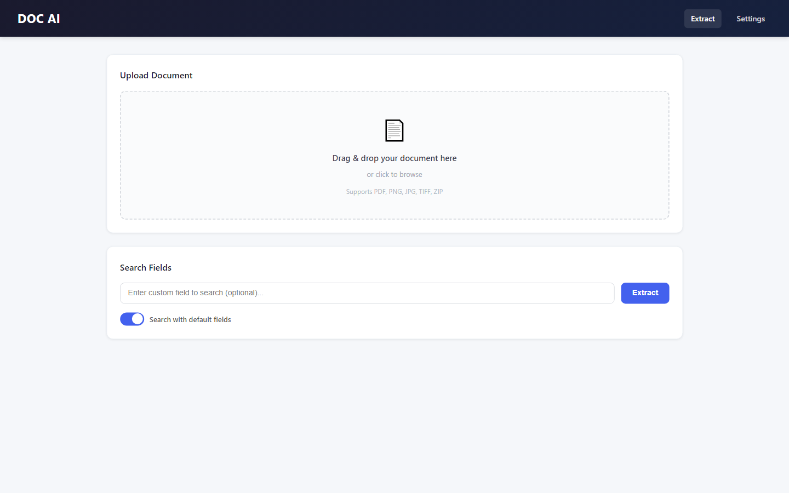
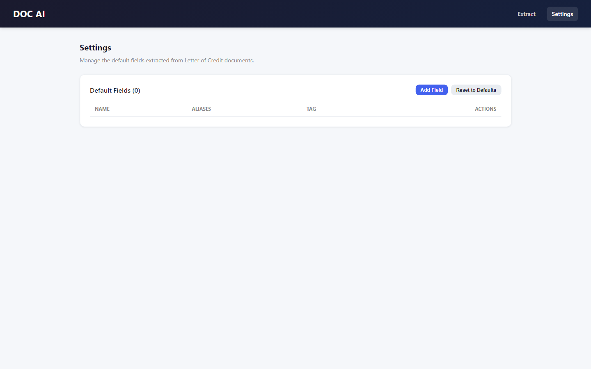

# Doctern — AI Document OCR & Table Extraction

> **Turn any PDF, scan, or image into clean, structured data — text and tables — in seconds.**

Doctern is an AI-powered document intelligence tool that extracts text, structured tables, and key fields from PDFs and images with high accuracy. Built for teams that are tired of manual data entry.

---

## Screenshots

A look at the Doctern document intelligence interface.

| Document Upload & Extraction | Field Configuration |
|:---:|:---:|
|  |  |

- **Document Upload & Extraction** — drag and drop a PDF, scan, or image; Doctern runs OCR, table detection, and field matching automatically.
- **Field Configuration** — define the named fields (invoice number, totals, dates) Doctern should pull from every document.

---

## What is Doctern?

**Doctern is an AI document OCR and table extraction platform.** You upload a PDF or image, and Doctern returns the text, the tables (with rows and columns preserved), and the specific fields you care about — ready to copy into Excel, Google Sheets, or your own systems.

It is designed for **invoice processing, form digitization, financial document extraction, and automated data entry** — anywhere a human would otherwise retype information from a document.

---

## Key Features

- **Accurate OCR** — extracts text from scanned documents, photos, and PDFs, including low-quality scans.
- **Structured table extraction** — detects table boundaries and preserves row-and-column relationships, not just loose text.
- **Intelligent field matching** — finds the specific fields you need (invoice number, totals, dates, names) even when layouts vary.
- **Borderless table support** — reconstructs tables that have no visible grid lines.
- **Copy-paste ready output** — generates clean HTML/structured tables that drop straight into spreadsheets.
- **Fast, modern interface** — upload, preview, and export in a clean web app.

---

## Who It's For

| Audience | Why Doctern helps |
|----------|-------------------|
| **Accounting & finance teams** | Stop retyping invoices, receipts, and statements. |
| **Operations teams** | Digitize forms, contracts, and paperwork at scale. |
| **Data teams** | Get clean, structured input instead of messy PDFs. |
| **Small businesses** | Automate data entry without hiring for it. |
| **Developers & integrators** | A reliable document-extraction layer for your product. |

---

## How It Works

1. **Upload** a PDF, scan, or image.
2. **Doctern processes** the document — OCR, table detection, and field matching run automatically.
3. **Review** the extracted text, tables, and fields in a clean preview.
4. **Export** structured data ready for spreadsheets or downstream systems.

*No manual templating. No retyping.*

---

## Technology

Doctern is built on a modern, production-grade stack:

- **Backend:** Python, FastAPI
- **OCR & vision:** deep-learning OCR, computer-vision table detection
- **Frontend:** React, Vite
- **Output:** structured JSON and spreadsheet-ready tables

> This repository is a **public showcase**. It documents the product — it does not contain the proprietary extraction engine or source code.

---

## Frequently Asked Questions

**What file types does Doctern support?**
PDFs, scanned documents, and common image formats (PNG, JPG).

**Can it handle tables without borders?**
Yes. Doctern reconstructs borderless tables by analyzing the spatial layout of the text.

**Is Doctern accurate on low-quality scans?**
Doctern uses deep-learning OCR that performs well on noisy, skewed, and low-resolution scans.

**Can I extract only specific fields?**
Yes. Doctern's field-matching finds named fields (like "Invoice Total" or "Date") even when document layouts differ.

**Is this open source?**
No. This repository is a marketing showcase. The product is proprietary — see the license below.

**How do I get access or a demo?**
See the **Contact** section below.

---

## Why Doctern

- ⚡ **Speed** — seconds per document instead of minutes of manual entry.
- 🎯 **Accuracy** — preserves table structure, not just raw text.
- 🧩 **Flexible** — adapts to varying layouts without per-template setup.
- 🔒 **Private** — your documents, your data.

---

## Contact & Demo

Interested in using Doctern, integrating it, or seeing a live demo? Get in touch with the development team.

| Developer | Email | WhatsApp |
|-----------|-------|----------|
| **Muhammad Maaz** | [mazwaseem098@gmail.com](mailto:mazwaseem098@gmail.com) | [+92 323 7609712](https://wa.me/923237609712) |
| **Muhammad Tanveer** | [mtanveertahir66@gmail.com](mailto:mtanveertahir66@gmail.com) | [+92 320 6688665](https://wa.me/923206688665) |

- **Company:** [Advenno](https://advenno.com)
- **GitHub:** [@maaz-gobi](https://github.com/maaz-gobi)

We work with businesses to automate document processing — get in touch to discuss your use case.

---

## License

This is a proprietary product. This repository contains documentation and marketing materials only. See [LICENSE](LICENSE) for terms.

---

**Keywords:** document OCR, AI table extraction, PDF data extraction, invoice OCR, automated data entry, document intelligence, scanned document extraction, PDF to Excel, form digitization, structured data extraction, FastAPI OCR, document parsing AI.
